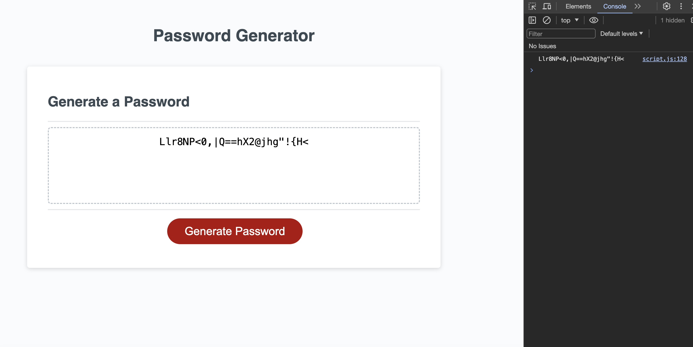

# strong-password-generator

## Description

The goal if this project is to randomly generate a strong password. When clicked on the generate password button the user is prompted to enter a desired password length from 8-128. After the user inputs a valid number, a series of confirm messages requests the selection of character types such as uppercase alphabets, lowercase alphabets, numbers, and special characters. Next, a random password is generated and presented to the user.

## Link to webpage
https://rafarizvi.github.io/strong-password-generator/

## Installation

N/A

## Usage

This is a random password generating website. It allows users to click a button and presents a prompt and a series of confirms to determine the use requirements for the password. Users can simply re-click the "generate password" button to generate a new password.

## Credits

N/A

## License

This project uses the MIT license.

## Badges

## Features

- Creates a strong randomly generated password.
- Allows users to click a button and asks them to input the desired password length.
- Uses character types such as uppercase, lowercase, numbers, and, special characters.
- Validates user responses on password length and character selections.
- Ensures atleast one value of the chosen character type(s) is present.
- Displays password on console and webpage. 

